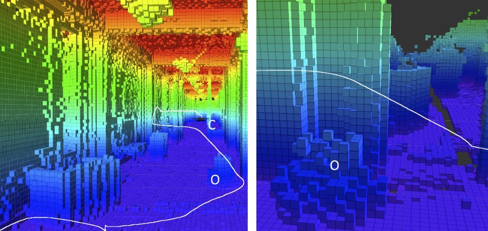

# UAV Sensor Fusion Demos

配套博客文章的示意代码与算法说明，对应《中国科技人才》2024 年第 1 期论文：

> 《基于传感器融合的自主避障无人机导航与控制算法研究》

博客完整讲解（含公式、示意图与工程清单）：  
https://ura2039.xyz/blog/posts/uav-sensor-fusion-paper/

## 仓库里有什么

| 文件 | 在讲什么 |
|---|---|
| `ekf_fusion.py` | IMU 高频 + 位置低频 → **EKF** 融合，顺带估计 IMU 零偏 |
| `voxel_esdf_potential.py` | 体素占据栅格 → **ESDF** → 势场法绕障 |
| `mpc_corridor.py` | 线性 **MPC** 写成二次规划，用「安全走廊」顶住侧风 |
| `08-voxel-grid-path.jpg` | 体素占据栅格地图与规划轨迹示意 |

根目录扁平放置，没有子目录。下面三章是博客正文「传感器融合 / 避障 / 导航控制」的文字说明（**不含代码块**）；可运行脚本请直接打开对应 `.py` 文件。

## 环境与运行

- Python **3.10+**
- `numpy`、`scipy`

```bash
pip install -r requirements.txt
python3 ekf_fusion.py
python3 voxel_esdf_potential.py
python3 mpc_corridor.py
```

期望大致输出：

- EKF：20 s 后 IMU 纯积分位置误差约数米，融合后亚米级，零偏估到约 `0.03`
- ESDF 势场：到达目标 `True`，全程离障最近约 `0.45 m`
- MPC：无走廊稳态偏移约 `+0.81 m`，加走廊后顶在 `0.6 m` 边界（约 `+4 mm` 属 SLSQP 数值容差）

这些是**教学/演示脚本**，不是飞控量产代码。工程落地可参考博客文末的 `ethzasl_msf`、`ego-planner` 等。

---

## 一、传感器融合原理

传感器融合的本质是**整合多个传感器的信息，以获取更全面、准确的环境数据**。本研究采用三类主要传感器：

| 传感器 | 提供的信息 | 短板 |
|---|---|---|
| 视觉传感器 | 周围地形、障碍物及其它重要特征的视觉信息 | 受光照、天气影响，单独使用数据不够可靠 |
| 激光雷达 | 精确的三维空间信息，检测物体位置与形状 | 相对最稳定，不受光照和天气干扰，复杂环境下表现良好 |
| 惯性导航 | 无人机的加速度与角速度，实时运动状态 | 随时间推移，积分误差累积，精度下降 |

融合的关键在于**通过精确的数据融合算法，把三类传感器的信息整合成一份综合性数据集**，从而弥补各自的缺点、实现更全面准确的环境感知。这份数据集支撑导航和控制算法的精确执行，让无人机在不同环境条件下都保持**适应性与稳健性**。

> **论文里最容易被忽略的一句**
>
> 上面这段里，「整合成一份综合性数据集」这个说法其实**藏着一个关键跳跃**：
>
> 三路传感器的输出根本不是同一种东西——相机给的是像素，激光雷达给的是点云，IMU 给的是角速度/加速度。它们**没法直接相加，也没法拼成一张表**。
>
> 工程上真正被融合出来的，不是「数据集」，而是**一个带不确定度的状态估计**：位置、姿态、速度，以及它们各自协方差。所谓"融合"，本质是**把三路观测都当成对同一个隐藏状态的带噪测量，然后反推出这个状态最可能的取值**。
>
> 这个认识一转变，后面所有问题（时间同步、标定、滤波）就都顺理成章地出现了——因为「同一个状态」这个前提，要求三路数据必须能对齐到同一时刻、同一个坐标系。

### 1.1 延伸：把三路数据合成一个位姿，中间隔着三道坎

论文点出了"为什么要融合"，但没有展开"融合具体怎么做"。真动手时，横在中间的是三件必须先解决的事：

| 坎 | 不做会怎样 | 工程上怎么做 |
|---|---|---|
| **时间同步** | 200 Hz 的 IMU 和 10 Hz 的雷达各说各话，高速飞行时 100 ms 的错位就是几十厘米的位置误差 | 每路数据带统一时基的时间戳，缓存在环形缓冲里，按时间对齐后再融合 |
| **外参标定** | 相机和雷达装在机体的不同位置、不同朝向上，同一个障碍物在两边算出的坐标对不上 | 离线标定出「传感器 → 机体」的旋转与平移，融合前先统一到机体坐标系 |
| **坐标系约定** | 一边用东北天、一边用北东地，偏航角正负号差一个方向，飞出去就是反的 | 全链路固定一套约定：惯导用 ENU，机体用 FLU，接口处显式转换 |

**① 时间同步是三件事里最容易被低估的。** 真实系统里各路传感器不但频率不同，**延迟也不同**：IMU 几乎无延迟，而 GPS 从测量到送达飞控通常有一百多毫秒的滞后。开源飞控 PX4 的 EKF2 用的办法很值得借鉴——它维护一条"**延迟融合时轴**"：所有传感器先按时间戳压进 FIFO 缓冲，滤波器每次推进到某个历史时刻，再从这个时刻附近取出各路观测一起融合。它的 `EKF2_GPS_DELAY` 参数默认值就是 **110 ms**，专门用来补偿 GPS 的测量延迟。

**② 外参标定**要在融合前做掉。相机、雷达、IMU 的安装位置不同，同一障碍物在各自坐标系里的坐标是不同的，必须通过离线标定求出「传感器 → 机体」的变换矩阵，融合时先统一。

**③ 还有一个隐蔽的问题：融合完的状态，比传感器本身还"旧"。** 因为要等各路延迟不同的观测到齐，滤波器输出的是**过去某一时刻**的状态。PX4 的解决办法是再串一级"**输出预测器**"：用缓冲的 IMU 数据把那个偏旧的状态向前外推到当前时刻，再交给控制器。这一级在实时系统里不能省——否则控制器拿到的永远是百毫秒前的信息。

> **判断一个融合框架好不好，先看它怎么处理时间**
>
> 只讲"融合多种传感器"而不讲时间同步与延迟补偿的方案，基本可以判定没上过真机。
>
> 因为**频率和延迟的差异是物理事实**，不会因为算法写得漂亮就消失。这也是我后来回头看这篇论文时，觉得最该补的一块。

### 1.2 延伸：从「互补滤波」到卡尔曼滤波

把 IMU 和三路外部观测合起来，最朴素的写法是**互补滤波**：让 IMU 负责高频（动态响应好），让外部观测负责低频（不漂），用一个高通加一个低通把两者叠起来：

$$\hat{\theta}(s) = \underbrace{\frac{s}{s+\frac{1}{\tau}}}_{\text{高通} \to \text{IMU}} \theta_{\text{IMU}}(s) + \underbrace{\frac{1}{s+\frac{1}{\tau}}}_{\text{低通} \to \text{外部观测}} \theta_{\text{观测}}(s)$$

它的优点是**算得极快、调参只有一个** $\tau$；缺点是**同一个 $\tau$ 兼顾不了"抗漂"和"抗噪"**，也没法表达"这个观测不可信"。

真实系统基本都会过渡到**扩展卡尔曼滤波（EKF）**。它的结构非常清晰，就两步：

**预测**（用 IMU 把状态推一步，同时把协方差一起推，不确定性变大）：

$$\hat{x}_{k}^{-} = f(\hat{x}_{k-1}, u_k), \qquad P_{k}^{-} = F_k P_{k-1} F_k^{\top} + Q_k$$

**更新**（来了观测就校正，用卡尔曼增益决定"信自己多少、信观测多少"）：

$$K_k = P_{k}^{-} H_k^{\top}\left(H_k P_{k}^{-} H_k^{\top} + R_k\right)^{-1}$$

$$\hat{x}_k = \hat{x}_{k}^{-} + K_k\left(z_k - H_k \hat{x}_{k}^{-}\right), \qquad P_k = (I - K_k H_k) P_{k}^{-}$$

这里几个量值得掰开说：

- $Q_k$ 是**过程噪声**：你有多不信任自己的运动模型（比如 IMU 的零偏、颠簸）
- $R_k$ 是**观测噪声**：你有多不信任这次观测（比如 GPS 的星数少，$R$ 就写大）
- $K_k$ 是**自动权衡出来的**：$R$ 大则 $K$ 小（不太相信观测），$P^{-}$ 大则 $K$ 大（不太相信自己）

这就是它比互补滤波强的地方——**"两边各信多少"是算出来的，不是一个固定的 $\tau$**。

业界成熟的 EKF 实现通常把状态扩到 **20 多个维度**（PX4 的 EKF2 是 24 状态）：除了位置、速度、姿态，还要把**陀螺零偏、加速度计零偏、地磁矢量、风扰动**等一起估掉。原因正是下面这段演示要说明的问题。

### 1.3 延伸：一段能跑的 EKF 融合

对应仓库里的 [`ekf_fusion.py`](./ekf_fusion.py)（不在 README 里贴代码，直接打开该文件即可）。

下面这段代码模拟了一个很典型的场景：**IMU 以 200 Hz 高频输出但含零偏，位置观测以 10 Hz 低频到来**。为了让对比有意义，我把 IMU 零偏也放进了状态向量里一起估。

实测输出：

20 秒里纯积分漂了 **9.28 m**，融合后压到 **0.35 m**。这就是论文那句"IMU 积分误差随时间累积"的具体量级——**它不是一个抽象的缺点，而是一个随时间平方增长的位置误差**，不融合根本没法用来定位。

> **零偏为什么只收敛到 0.032，而不是真值 0.050？**
>
> 这不是代码写错了，而是一个很本质的现象：**在匀加速运动下，加速度计零偏和真实加速度是不可分辨的。**
>
> `0.05 的零偏 + 0.3 的真实加速度` 和 `0 的零偏 + 0.35 的真实加速度`，在 IMU 输出上完全一样。滤波器只能靠位置观测的"不漂"来反推零偏，所以收敛得慢，20 秒只能收敛到一半。
>
> 要真正把零偏估准，得靠**机动激励**——让飞行器做变速/转向动作，不同方向的加速度把零偏"晒"出来。这也是为什么很多飞控要求起飞前必须先做静止初始化。
>
> 顺带一提，这个"可观性"问题在工程上还有个好用的判据：**你在数据里看到的偏差，究竟该归给状态还是归给传感器误差，取决于运动有没有充分激励**。这一点在调参时特别容易被误判成"这个传感器坏了"。

---

## 二、避障算法设计

避障算法的核心问题是：**如何通过实时分析传感器数据，判断可能的障碍物并采取相应措施规避**。

这需要一个复杂而高效的避障逻辑：它要**综合考虑障碍物的位置、无人机的速度、姿态等多个因素**，以确保飞行的平稳性和安全性。论文用一组模拟数据来具体化这个过程。

**表 1 传感器测得的障碍物位置和无人机状态**

| 时间（秒） | 障碍物 X 坐标（米） | 障碍物 Y 坐标（米） | 无人机速度（米/秒） | 无人机姿态角度（弧度） |
|---|---|---|---|---|
| 0 | 10 | 5 | 5 | 0.5 |
| 1 | 12 | 8 | 6 | 0.8 |
| 2 | 15 | 10 | 7 | 1.2 |
| 3 | 18 | 12 | 8 | 1.5 |
| 4 | 20 | 15 | 9 | 1.8 |

### 2.1 论文的三条公式

**公式 1：避障距离计算。**先定义**避障距离阈值**（本研究中设为 **5 米**）：当无人机与障碍物的距离小于该阈值时，就需要执行避障动作。无人机与障碍物之间的**欧几里得距离**：

$$D_{\text{避障}} = \sqrt{(X_{\text{障碍}} - X_{\text{无人机}})^2 + (Y_{\text{障碍}} - Y_{\text{无人机}})^2}$$

若 $D_{\text{避障}}$ 小于避障距离阈值，即表示需要启动避障。

**公式 2：速度调整。**依据距离与速度的关系调整无人机速度：

$$V_{\text{新}} = V_{\text{原}} - k \cdot (D_{\text{避障}} - D_{\text{阈值}})$$

其中 $V_{\text{新}}$ 是调整后的速度，$V_{\text{原}}$ 是原始速度，$k$ 是调整系数。

**公式 3：姿态调整。**通过姿态调整确保无人机在避障过程中保持平稳：

$$\theta_{\text{新}} = \theta_{\text{原}} + \alpha \cdot (D_{\text{避障}} - D_{\text{阈值}})$$

其中 $\theta_{\text{新}}$ 是调整后的姿态角度，$\theta_{\text{原}}$ 是原始姿态角度，$\alpha$ 是调整角度的系数。

> **这三个公式的关系**
>
> 三个公式构成一套"**感知 → 减速 → 转姿**"的串联逻辑：
>
> 1. 公式 1 判断**会不会撞**（距离是否越界）
> 2. 公式 2 决定**要不要慢下来**（距离越近、减得越多）
> 3. 公式 3 决定**往哪边偏**（同时调整姿态保持平稳）
>
> 它们通过**实时计算距离、调整速度和姿态**，让无人机在遇到障碍物时能做出及时、平稳的规避动作。论文也指出，这个算法的复杂性正体现在"综合考虑多个因素"上——通过实际数据与公式的结合，才能更好地理解和评估无人机在复杂环境中的避障能力。

### 2.2 延伸：这三条公式其实就是「一个比例控制器」

把公式 2 和公式 3 抄近一点看：

$$V_{\text{新}} = V_{\text{原}} - k \cdot \underbrace{(D_{\text{避障}} - D_{\text{阈值}})}_{\text{误差 } e}$$

如果把 $(D_{\text{避障}} - D_{\text{阈值}})$ 看成**误差** $e$，那么这两条式子就是标准的**比例控制**：输出 = 系数 × 误差。$k$ 和 $\alpha$ 就是比例增益。

这个等价关系很有用，因为它一次性带来了三个已知结论：

| 比例控制的已知性质 | 在这套避障公式上的表现 |
|---|---|
| 增益太小收敛慢 | $k$ 取小了，飞机会"慢悠悠地蹭"过去，避障动作不果断 |
| 增益太大会振荡 | $k$ 取大了，速度在阈值附近反复横跳，姿态也跟着抖 |
| **纯比例一定存在稳态误差** | 距离恰好压在阈值时输出为零，**它不会主动把距离拉回到一个安全余量** |

最后一条是这个方案最本质的局限：**纯比例控制只能"按误差线性回应"，做不到"提前留出安全余量"**。而避障恰恰是个需要余量的场景。

（先别往下看，自己推一下：当 $D_{\text{避障}}$ 恰好等于阈值时，公式 2 和公式 3 给出的调整量是多少？两个式子里的 $(D_{\text{避障}} - D_{\text{阈值}})$ 都等于 0，所以速度不变、姿态不变——飞行器就停在"刚好要撞"的边界上，不做任何反应。这就是"纯比例不给余量"的数学根源：**误差为零时控制量为零**，于是它天然缺少"离远一点"的驱动力。）

> **三个公式里没出现"速度方向"**
>
> 公式 1 用的是**欧氏距离**，是个标量，它不含方向信息。
>
> 这意味着一个很实际的漏洞：**无人机以 10 m/s 迎面冲向障碍物**，和**背对着障碍物以 10 m/s 远离**，只要距离相同，算出来的 $D_{\text{避障}}$ 完全一样，公式 2、3 给出的调整量也完全相同。
>
> 换句话说，这套判据**分不清"正在靠近"和"正在远离"**。要补上这个信息，就得引入下面这个量。

### 2.3 延伸：更常用的判据——碰撞时间 TTC

真正决定"危不危险"的不是**距离**，而是**距离 ÷ 接近速度**，也就是**碰撞时间**（Time To Collision, TTC）：

$$\text{TTC} = \frac{D_{\text{避障}}}{\max\left(-\dfrac{dD}{dt},\ \varepsilon\right)}$$

分母是接近速率（距离的负导数），加 $\varepsilon$ 只是防止除零。TTC 的物理含义很直白：**按当前速度不变，还有多少秒会撞上**。

它比纯距离判据好在三点：

- **含了速度信息**：正以 10 m/s 迎面冲来（TTC = 1 s）和静止悬停（TTC → ∞）被明确区分开
- **量纲统一**：单位是秒，阈值可以直接按"人的反应时间/飞控的刹车距离"来定，容易理解也容易调
- **天生适合多机与动态障碍**：对方也在动时，距离判据会失效，TTC 仍然成立

不同判据的对照：

| 判据 | 核心式子 | 优点 | 局限 |
|---|---|---|---|
| **欧氏距离**（论文所用） | $\sqrt{\Delta x^2 + \Delta y^2}$ | 最好算，无参数 | 不含速度与方向，分不清靠近/远离 |
| **碰撞时间 TTC** | $D / \dot{D}$ | 含接近速度，量纲直观 | 平行飞行时 $\dot{D} \to 0$，TTC 爆表需特殊处理 |
| **人工势场法** | 引力 + 斥力叠加 | 输出是连续的力/加速度，可直接接控制器 | 存在局部极值，目标在凹形障碍后可能卡住 |
| **碰撞锥 / 速度障碍** | 相对速度是否落在锥内 | 显式给出"哪些速度安全"，适合动态环境 | 计算量较大，多障碍时要逐个求交 |

下面这段就是把「距离判据」升级成「TTC 判据」的改动思路，用 diff 的写法看更清楚：

> **为什么"阈值 5 米"这种写法在工程上很难落地**
>
> 论文把避障阈值定为 5 米。但如果飞机速度从 5 m/s 提到 15 m/s，**5 米的预警距离就只有 0.33 秒**——扣掉传感器延迟、算法耗时和执行器响应，实际已经来不及了。
>
> 所以工程上更稳的做法是把阈值写成**速度的函数**（或直接用 TTC）：`D_threshold = 刹车距离 + 安全余量`，其中刹车距离随速度平方增长。这样阈值会自己跟着速度调整，高速时自动变宽。

### 2.4 延伸：从「障碍物坐标列表」到「体素占据栅格」

论文的表 1 是一种很"教科书"的表示：把障碍物存成**坐标点**。这在仿真里很方便，但真机上有两个问题：

1. 激光雷达一秒回来的是**几十万个点**，逐个当障碍物去算距离根本算不过来
2. 障碍物不是点，是**有体积的形状**，用点表示会丢掉"这个方向有多宽"的信息

现实中的做法是先把空间**离散成一个三维格网**，每个格子标记"有没有被占据"，这就是**体素占据栅格**（voxel occupancy grid）：

$$M(i,j,k) = \begin{cases} 1, & \text{该体素被占据} \\ 0, & \text{该体素空闲} \end{cases}$$

点云落进哪个格子，就把哪个格子置 1（实际实现里还会用概率滤波处理噪点，避免一个飞点就在地图上戳出一堵墙）。



上图是这类地图的一个典型样子：**颜色不是装饰，而是高度的映射**（红=高、蓝=低），这样一眼就能看出三维结构；白线是规划器在栅格地图里搜出来的轨迹。可以看到它绕着障碍的凸起走，而不是贴着走。

**但这张图里最关键的其实是没画出来的那一步。**栅格只回答了"这个格子能不能走"（是离散的是/否），而规划器和控制器需要的是"**离最近的障碍还有多远**"（是连续的数值）。把前者变成后者，靠的是 **ESDF（欧氏符号距离场）**：

$$\text{ESDF}(v) = \begin{cases} +\min_{u \in \text{障碍}} \lVert v - u \rVert, & v \text{ 在空闲区} \\[4pt] -\min_{u \in \partial \text{障碍}} \lVert v - u \rVert, & v \text{ 在障碍内} \end{cases}$$

也就是**给每个体素存一个数：它到最近障碍的距离**。符号表示在障碍外还是里（负号就是在障碍内部）。

这个数据结构一旦建好，避障就变得非常"便宜"——因为它同时提供了两个东西：

| ESDF 提供 | 用来干什么 |
|---|---|
| **距离值** | 直接当安全裕量用：`ESDF(v) > 安全半径` 就是安全的 |
| **梯度 $\nabla \text{ESDF}$** | 直接当**远离障碍的方向**用，而且指向的是"最短逃逸方向" |

梯度这一条特别关键：**它把"往哪边躲最好"这个决策，变成了一个查表加求导的操作**。前一节的受力方向、后一节的轨迹优化，用的都是这个梯度。业界成熟的实现里，Voxblox 用 TSDF 增量构建 ESDF，EGO-Planner 则直接在 ESDF 上做梯度下降优化轨迹。

### 2.5 延伸：一段能跑的「栅格 → ESDF → 势场避障」

对应仓库里的 [`voxel_esdf_potential.py`](./voxel_esdf_potential.py)。

把 2.3 节的势场法和 2.4 节的 ESDF 接起来，就是下面这段。它把地图离散成 0.2 m 的栅格，用 `scipy` 一次性算出 ESDF，再让一个质点顺着"引力 + ESDF 梯度斥力"飞过去：

实测输出：

> **这段输出里藏着势场法的两个老毛病**
>
> 能到目标，但请对照两个数：
>
> **① 路径明显绕远。**起点 (1, 0.5) 到终点 (22, 22) 的直线距离约 **29.9 m**，实际飞了 **38.1 m**，多出 28%。因为这股力是"局部"的——只在看得见的斥力范围内起作用，**没有全局最优的概念**。
>
> **② 全程离障碍最近只有 0.45 m。**它确实没撞上，但是"贴着边蹭过去"的。势场法的斥力与距离平方成反比，**在接近障碍时增长得很快，可一旦越过了"最危险的那一点"，斥力就骤减**，于是轨迹表现为贴着障碍画弧。
>
> **还有第三个更致命的问题，这段代码恰好避开了**：势场法存在**局部极值**——如果目标正好落在一个凹形（比如 U 形）障碍的开口里，引力和斥力会在某个位置正好抵消，飞行器就停在那里，既到不了目标也不撞上去。这是纯势场法无法根治的缺陷，工程上要么改用**基于搜索的全局规划 + 局部优化**，要么加随机扰动跳出极值。

> **本节的诚实说明**
>
> 论文并没有用势场法，也没有用体素栅格和 ESDF——它用的是**障碍物坐标 + 欧氏距离阈值**。
>
> 上面这一节（以及下面第三、四节的延伸部分）是我在写这篇文章时补的：**用来说明"论文的思路接到真实工程上会长成什么样"**。这两者我刻意分开标注，请不要把这几段当成论文的内容。

---

## 三、导航精度与控制稳定性优化

为了让无人机在复杂环境中更灵活、精准地导航，研究集中在**数据处理**与**算法优化**两方面。

### 3.1 数据处理

论文关注传感器数据的**准确性和实时性**，使用 GPS、陀螺仪、加速度计等获取关键飞行数据，实时监测无人机的姿态、速度和加速度。

**表 2 传感器类型与准确性要求**

| 传感器 | 类型 | 准确性要求 |
|---|---|---|
| 全球定位系统 | 定位 | 高 |
| 陀螺仪 | 姿态 | 高 |
| 加速度计 | 加速度 | 高 |

在数据采集过程中优化传感器融合算法，确保各传感器数据的**协同工作**，提升整体数据准确性：

$$D_{\text{处理后}} = F_{\text{fusion}}\left(D_{\text{GPS}},\ D_{\text{陀螺仪}},\ D_{\text{加速度}}\right)$$

其中 $D_{\text{处理后}}$ 是经过处理后的数据，$F_{\text{fusion}}$ 是传感器融合算法，另外三项分别表示 GPS、陀螺仪和加速度计采集的原始数据。

> **公式里的 $F_{\text{fusion}}$ 是什么？**
>
> 这个式子是个**占位符**——它诚实地表示了"输出 = 融合函数（输入…）"这个结构，但没有说明 $F_{\text{fusion}}$ 具体是什么形式。
>
> 本文第一节的 EKF 就是 $F_{\text{fusion}}$ 的一个具体实现：**它同样接受 GPS、陀螺仪、加速度计三路输入，输出一个状态。**区别只是它还会多输出一份协方差（不确定性），并且是递归的（上一时刻的估计会参与下一时刻的计算）。
>
> 顺带说，$F_{\text{fusion}}$ 前面的"数据处理"其实还有一段很脏但绕不开的活：**去畸变、时间戳对齐、坏点剔除、滑窗平滑**。论文用一句"提升整体数据准确性"概括了，但真机上这几步的工作量往往比融合本身还大——**传感器给的数据永远没有说明书上那么干净**。

### 3.2 算法优化：姿态控制用 MPC

算法优化聚焦**姿态控制**与**航迹规划**两个环节。

**姿态控制采用模型预测控制（Model Predictive Control, MPC）**——该算法通过**预测未来一段时间内的飞行状态**来优化控制指令，从而实现对无人机的高效控制：

$$U^{*} = \arg\min \sum_{k=0}^{N-1} L(x_k, u_k) + V(x_N)$$

其中 $U^{*}$ 是最优控制输入序列，$x$ 是飞行状态，$u$ 是控制指令，$N$ 是预测时域，$L$ 和 $V$ 分别是每一步的代价函数和终端代价函数。

> **MPC 为什么适合无人机**
>
> MPC 的核心思想是"**滚动优化**"：每一时刻都根据当前状态预测未来 $N$ 步，解出一个最优控制序列，但**只执行第一步**，下一时刻重新预测、重新求解。
>
> 这对无人机特别契合——因为无人机的动力学约束（最大推力、最大角速度）可以**显式写进优化问题**，而不像 PID 那样只能靠调参事后弥补。代价是每一控制周期都要解一次优化问题，对算力有要求。

### 3.3 延伸：把 MPC 写成二次规划

论文给出的 $\arg\min \sum L + V$ 是 MPC 的**通用形式**，但没说明怎么解。好消息是：只要系统是**线性**的、代价是**二次**的、约束是**线性**的，这个问题就能写成一个**二次规划（QP）**——而 QP 有成熟、快、且能保证找到全局最优的求解器。

具体怎么落地，步骤是固定的三步：

**第一步：把预测展开成矩阵形式。**设状态 $x_k \in \mathbb{R}^{n}$、控制量 $u_k \in \mathbb{R}^{m}$、离散动力学 $x_{k+1} = A x_k + B u_k$，把 $N$ 步全部叠成一个大向量 $X = [x_1; \dots; x_N]$、$U = [u_0; \dots; u_{N-1}]$，那么：

$$X = \underbrace{\begin{bmatrix} A \\ A^2 \\ \vdots \\ A^N \end{bmatrix}}_{\bar{A}} x_0 + \underbrace{\begin{bmatrix} B & 0 & \cdots & 0 \\ AB & B & \cdots & 0 \\ \vdots & & \ddots & \vdots \\ A^{N-1}B & A^{N-2}B & \cdots & B \end{bmatrix}}_{\bar{B}} U$$

**第二步：把代价函数代进去，得到标准二次型。**把 $X$ 的表达式代入二次代价，$x_0$ 就退化成一个常数项，剩下的只有 $U$：

$$J(U) = \tfrac{1}{2} U^{\top} H U + f^{\top} U + \text{const}, \qquad H = 2\left(\bar{B}^{\top}\bar{Q}\bar{B} + \bar{R}\right), \quad f = 2\bar{B}^{\top}\bar{Q}\left(\bar{A}x_0 - X_{\text{ref}}\right)$$

**第三步：把约束写成线性不等式。**这一步是重点，因为**"避障"就是从这里进场的**——不管是安全走廊还是位置上下界，最终都变成同一种形式：

$$H_j\, p_k \le h_j$$

其中 $p_k$ 是第 $k$ 步预测位置，$(H_j, h_j)$ 描述一个半空间。一串这样的半空间求交，就是一个**凸多面体**，也就是所谓的**安全飞行走廊（Safe Flight Corridor, SFC）**。它的妙处在于：**把"别撞墙"这个几何问题，翻译成了一条线性不等式**——而线性不等式恰好是 QP 最擅长处理的东西。

> **一个必须注意的坑：ESDF 约束是「非线性」的**
>
> 上一节说 ESDF 提供了距离和梯度，看起来很完美。但如果直接把 `ESDF(p) ≥ 安全半径` 当作约束写进 QP，**这个 QP 就不再是标准的二次规划了**——因为 ESDF 是格网上查表插值出来的，对 $p$ 而言是**非线性、非凸**的函数。
>
> 工程上有两条主流绕法：
>
> 1. **先近似成凸多面体**：用 A* 搜出一条几何路径，在路径周围构造一串**互相重叠的凸多面体**（就是 SFC），把非线性约束换成线性约束，QP 直接能解。代价是走廊构造这一步本身有开销，而且走廊一旦生成，优化器就只能在这个"笼子"里找解。
> 2. **保留非线性、用 SQP / 实时迭代（RTI）线性化**：在预测点处对 ESDF 做一阶展开，用线性化后的约束迭代求解。精度更高，但对初值敏感，也更难调试。
>
> 实际系统里方案 1 是主流，因为它把"安全性"的证明变简单了：**只要轨迹在走廊内、走廊内没有障碍，那轨迹就一定安全。**

### 3.4 延伸：一段能跑的 MPC + 安全走廊

对应仓库里的 [`mpc_corridor.py`](./mpc_corridor.py)。

下面这段代码用一个横向双积分模型（状态 = 横向位置与速度）演示方案 1 的思路：把"每一步预测位置都在走廊内"写成两条线性不等式，然后用 `scipy` 解 QP。

场景设定是**恒定侧风**——一个没写进模型的外部扰动。它很有代表性，因为它刚好能看出**代价函数和硬约束的分工**：

实测输出：

> **这段输出回答了「为什么光有代价函数不够」**
>
> 注意第一行和第二行的对比：**同一套代价权重，加不加走廊约束，稳态偏移差了 0.2 m。**
>
> - **不加走廊**：代价函数只是"倾向于"回到 $y=0$。侧风一直在推，代价函数又没有"绝对不许越界"这个语义，于是它稳定在一个**新的平衡点 0.811 m** 上——**代价函数默许了越界**。
> - **加了走廊**：约束把 $|y_k| \le 0.6$ 变成**硬性的可行性条件**，优化器被迫在边界上重新分配控制量，最终**顶在 0.604 m 就不再往外走**。
>
> 这就是**软约束（代价）和硬约束（不等式）的本质差别**：
>
> | | 作用方式 | 越界时的表现 | 在这段代码里 |
> |---|---|---|---|
> | **代价函数** | 偏好 | 越界只是"代价大一点"，可以被别的好处抵消 | 稳态漂到 0.811 m |
> | **硬约束** | 可行性 | 越界的解**根本不被允许**，求不出就报不可行 | 停在 0.604 m |
> | **两者配合** | 代价决定"多快回到线上"，约束决定"绝不能出界" | —— | 控制量仅用掉 −1.79 / ±2.0 |
>
> 顺带说，控制量只用掉 −1.79，说明**这次约束是"够得着"的**——如果侧风强到超过执行器权限（比如侧风 2.5 m/s² 而上限是 2.0），那么无论怎么优化都守不住，QP 会变成**不可行问题**。真实的 MPC 必须专门处理这种不可行情况（比如松弛变量 + 优先级降级），否则求解器会返回一个数值上看起来很怪的结果。

### 3.5 航迹规划

**航迹规划**采用基于地图信息的路径规划算法，确保导航过程中能避开障碍物、选择最优路径：

$$P_{\text{最优}} = \arg\min C(P)$$

其中 $P_{\text{最优}}$ 是最优路径，$C$ 是路径代价函数，**考虑了路径长度和避障等因素**。

> **代价函数 $C(P)$ 里到底装了什么**
>
> 论文只说了"考虑路径长度和避障"。实际工程里，$C$ 通常是一个**加权和**，每一项对应一个飞行品质要求：
>
> $$C(P) = \underbrace{w_1 \int \lVert \dot{p} \rVert \, dt}_{\text{路径长度}} + \underbrace{w_2 \int \lVert \ddot{p} \rVert^2 dt}_{\text{平滑度（省电、好跟踪）}} + \underbrace{w_3 \int \lVert p^{(3)} \rVert^2 dt}_{\text{加加速度（乘客/相机舒适度）}} + \underbrace{w_4 \cdot \text{越界惩罚}}_{}$$
>
> 权重的取法直接决定飞出来的风格：$w_1$ 大就飞直线、贴着障碍抄近路；$w_3$ 大就飞得很"温吞"但视频画面稳。**所谓"算法调参"，很多时候就是在调这几个 $w$。**
>
> 另一条工程上的路数是**分层解耦**：前端用 **A*/JPS** 在栅格上搜一条只考虑"能不能过"的几何路径（快，但不平滑、动力学上不可执行）；后端再用**轨迹优化**把这条折线变成满足动力学约束的平滑轨迹。上图正是这个分层结构。

### 3.6 论文给出的实验数据

通过数据处理与算法优化的综合作用，无人机的导航精度与控制稳定性得到提升。论文给出的实际飞行测试参数变化：

**表 3 优化下参数变化**

| 测试参数 | 优化前 |
|---|---|
| 导航误差 | 5 米 |
| 姿态稳定性 | 较差 |
| 控制响应时间 | 100 毫秒 |

> **关于这张表，有些话必须说清楚**
>
> 按论文原文，表 3 记录的是**优化前**的基线数据（导航误差 5 米、姿态稳定性较差、控制响应时间 100 毫秒）。原文在表述上提到"从表 3 可以看出优化下无人机的导航误差大幅减小、姿态稳定性显著提升、控制响应时间也有所缩短"。
>
> **这里存在一处数据与论述的不一致**：表里只有"优化前"一列，却要论证优化后的改善。
>
> 我更倾向于把它理解为一组**基线参照值**——它给出了优化前的水平，作为后续改进的对照。但如果要严谨地支撑"大幅减小、显著提升"这类结论，至少还需要补上：
>
> - **优化后的对照列**（导航误差降到多少米、响应时间缩短到多少毫秒）
> - **测试样本量**（飞了几架次？单次还是多次平均？）
> - **误差指标的定义**（导航误差是相对真值还是相对规划轨迹？怎么测的？）
>
> 这是这篇论文在实验呈现上最明显的可完善之处。我在下面把它改写成一张能真正说明问题的表：
>
> | 测试参数 | 优化前（基线） | 优化后 | 相对变化 | 统计口径 |
> |---|---|---|---|---|
> | 导航误差 | 5 米 | *待补* | *待补* | 建议：相对 RTK 真值的 RMSE |
> | 姿态稳定性 | 较差 | *待补* | *待补* | 建议：姿态角速度的 RMS 或超调量 |
> | 控制响应时间 | 100 毫秒 | *待补* | *待补* | 建议：阶跃指令的上升时间 / 相位滞后 |

不过整体上，通过在数据处理和算法优化上的投入，论文认为在提高无人机飞行性能方面取得了明显成果。这个方法不仅在理论上有支持，在实际测试中也得到了令人满意的结果。

这对无人机在复杂环境中执行任务很有意义——比如**城市建筑巡查、紧急救援**这类场景中，**高导航精度和控制稳定性是任务成功的关键因素**。

---

## License

MIT
